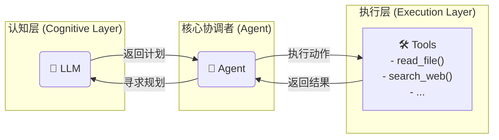
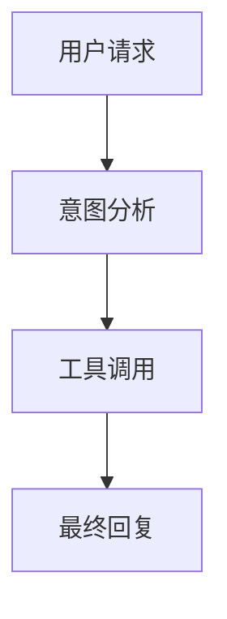

# Agent 简明教程

这里会写一下我实现这个案例项目的思路，以及一些知识点的补充。如果后续我学到了新的/正确的知识，我会更新这个文档。

### Agent / LLM / Tool 关系图

**Agent** 是整个系统的核心协调者。它像一个项目经理，负责理解用户需求，并调度不同专家（**LLM** 和 **Tools**）来完成任务。

*   **LLM (大语言模型)**：是 Agent 的“大脑”，负责**思考和规划**。Agent 将当前情况和可用工具告知 LLM，LLM 分析后返回下一步的行动计划。
*   **Tools (工具集)**：是 Agent 的“手脚”，负责**执行具体操作**。这些工具可以是查询数据库、调用 API、读写文件等任何函数。

它们之间的协作关系如下：



### 从 System Prompt 开始

我们在和**大模型（LLM）**对话的时候，由于模型的回复是随机的，我们希望模型能够按照一定的**角色、身份、立场或风格**来回复，就需要请提前给模型一些提示（Prompts），这些提示就是 **System Prompt**。它用于确定模型回复的整体基调。

但是此时，模型只是能和我们“对话”，并没有**“手脚”**去执行一些外部操作。

### 早期方案：AutoGPT

**AutoGPT** 想了一个聪明的办法来解决模型没有“手脚”的问题：

1.  开发者自行实现一些**工具（Tool）**，例如 `read_file()` 或 `search_web()`。
2.  通过 **System Prompt**（使用自然语言）来和模型达成一种“口头协议”，告诉模型：
    *   “我有这些工具，它们的作用分别是什么。”
    *   “如果你需要调用哪个工具，请用特定的格式回复我工具名和参数。”
3.  **Agent**（AutoGPT 自身）解析模型的回复。如果发现是工具调用指令，就去执行对应的**工具**。
4.  **Agent** 将工具的执行结果，再次通过 Prompt 返回给模型，告诉它：“你刚才指令的执行结果是......”。
5.  模型根据新的结果，继续下一步的思考和对话。

总结起来，**AutoGPT** 通过“口头协议”和“工具调用”，让模型有了“手脚”。此时 **AutoGPT** 的身份就是 **Agent**，它负责在 **LLM** 和 **Tools** 之间进行协调和信息传递。

然而，这种方法并不稳妥。问题就在于这个“口头协议”完全依赖自然语言，如果模型不够聪明，或者用户请求比较模糊，出错的几率就会大大增加。为了保证准确性，往往需要进行多次“对话重试”，这会消耗大量的 **Token**。

因此，我们需要一种更标准化的方式来让模型执行操作。

### 现代方案：Function Calling

为了解决上述问题，模型厂商提出了 **Function Calling** 的概念。

这个功能的核心思想是，将“口头协议”升级为**结构化的数据**（通常是 **JSON**）：

1.  每一个**工具（Tool）**都用一个标准化的 **JSON Schema** 来描述它的名称、功能、参数等。

    ```json
    {
        "name": "get_current_time",
        "description": "获取指定时区的当前时间",
        "parameters": {
            "type": "object",
            "properties": {
                "timezone": {
                    "type": "string",
                    "description": "时区，例如 'Asia/Shanghai'"
                }
            },
            "required": ["timezone"]
        }
    }
    ```

2.  当模型需要调用工具时，它不再返回一段自然语言，而是直接返回一个符合格式的 **JSON** 对象，表明要调用哪个函数以及传递什么参数。

    ```json
    {
        "name": "get_current_time",
        "parameters": {
            "timezone": "Asia/Shanghai"
        }
    }
    ```

如此一来，**Agent** 和 **LLM** 之间的沟通就从模糊的“口头协议”变成了精确的“数据交换”，这带来了两个巨大的好处：

1.  **准确性提升**：由于格式是标准化的，LLM 可以被专门训练来生成这种格式，大大减少了理解错误的概率。
2.  **效率提升**：模型厂商可以在*服务器*端对输出的 JSON 进行校验和重试，这个过程**不消耗 Token**，降低了使用成本。

### Function Calling 并非银弹

很显然，**Function Calling** 也有自己的缺点，最明显的就是：

*   **没有统一标准**：Google、OpenAI、Anthropic 等厂商的 Function Calling 格式各不相同。
*   **模型支持有限**：并非所有模型都支持此功能。

### 协议层：MCP (Model-Context-Protocol)

上面我们讲的都侧重于 **Agent** 和 **LLM** 之间的交互。其实还有另一侧的交互，那就是 **Agent** 和 **Tool** 之间的交互。

最初，**Agent** 和 **Tool** 都是写在一起的，运行在同一个进程中。但很多工具是通用的，比如文件读取、网络请求、数据库查询等。如果我们要在每一个 **Agent** 中都重复实现一遍，显然是不合理的。

所以，业界提出了 **MCP (模型-上下文-协议)** 的概念，用于规范 **Agent** 和 **Tool Server** 之间的通信。

**MCP** 规定了客户端（Agent）和服务端（Tool Server）之间如何通信，服务端需要提供哪些接口（例如，查询自己拥有哪些工具、工具的功能描述和参数等）。除了管理工具调用，MCP 也可以用来管理 **Resources (资源)** 和 **Prompts (提示)**。

通过 MCP，工具可以作为独立的服务部署，Agent 通过标准化的协议（如 HTTP 或 Stdio）与它们通信。

我们项目中的 `mcp` 模块就是这个理念的实现。它负责处理 **Agent** 和 **Tool** 之间的交互，让 Agent 可以方便地使用各种工具，而不用关心工具的具体实现和部署位置。因此，**MCP 本质上与 LLM 没有直接关系**，它是一个独立的、可扩展的工具管理与执行层。

### 做个补充
如今大模型已经足够聪明，我们可以不需要function calling 这种模式，使用prompt效果已经够好，而且兼容性更好。

### 多Agent

随着AI应用的复杂化，单一Agent往往无法处理所有类型的任务。多Agent系统通过将不同领域的专业能力分配给不同的Agent，实现了更好的任务处理效果。

#### 多Agent架构的优势

1. **专业化分工**：每个Agent专注于特定领域，提供更准确的服务
2. **可扩展性**：可以根据需要添加新的专业Agent
3. **模块化管理**：Agent之间相对独立，便于维护和更新
4. **负载分散**：不同类型的请求可以由相应的专业Agent处理

### agent设计与实现

#### agent基础interface设计
我们先确定我们的Agent的interface。我们先创建一个teach.agent.ts文件，我们后续的代码都在这个文件中实现。
```ts
interface IAgent {
    llm: any
    tools: any[]
    prompt: string
}
```
我们之前讲过，agent就是协调tool和llm的，所以我们的参数里面两个必须要有的就是llm和tools，prompt作为系统提示词可以选填。
至此，我们迈出了第一步，也就是我们确定了我们的Agent`长什么样`。

#### 创建大模型实例
这一步我们使用deepseek举例子。
```ts
import { ChatDeepSeek } from '@langchain/deepseek'

const llm = new ChatDeepSeek({
    apiKey: 'your-api-key', // 你的api key
    model: 'deepseek-chat', // 可选 'deepseek-chat' 或 'deepseek-reasoner'
    temperature: 0.5, // 温度
    streaming: true, // 流式输出
})
```
为了方便我直接使用了 @langchain/deepseek 这个包。它会默认帮我们设置baseURL为https://api.deepseek.com/v1。
deepseek兼容openai，如果你使用的是openai的npm包也是可以使用deepseek的。如下：
```ts
import OpenAI from 'openai'

// 初始化客户端
const llm = new OpenAI({
    apiKey: 'your-deepseek-api-key', //  替换为你的DeepSeek API密钥
    baseURL: 'https://api.deepseek.com/v1', // DeepSeek API地址
})
```

至此，我们迈出了第二步，也就是我们创建了我们的LLM实例。

#### 创建工具
```ts
interface Tool {
    name: string // 工具名称
    description: string // 工具描述
    func: (...args: any[]) => any // 工具函数
}
```
```ts
/**
 * 创建工具
 * @description 这里我们以读取文件为例
 */
const readFileTool: Tool = {
    name: 'read_file',
    description: '读取文件',
    func: async (filePath: string) => {
        return fs.readFileSync(filePath, 'utf-8')
    },
}
const helloWorldTool: Tool = {
    name: 'hello_world',
    description: '当用户问你hello world时，你回复hello world',
    func: async () => {
        return 'hello world'
    },
}
const tools: Tool[] = [readFileTool, helloWorldTool]
```
至此，我们迈出了第三步，也就是我们确定了我们的Tool`长什么样`。

#### 让Agent周转于LLM和Tool之间
根据上述的Agent的interface，我们知道了我们创建Agent的时候需要传递哪些参数。 根据这些，我们先实现一个Agent的类。
```ts
// ------------
// 之前的代码略去
// -------------

import { BaseLanguageModel } from '@langchain/core/language_models/base'

interface Tool {
    name: string
    description: string
    func: (...args: any[]) => any
}

class Agent implements IAgent {
    private llm: any
    private tools: Tool[]
    private prompt: string

    constructor(llm: BaseLanguageModel, tools: Tool[], prompt: string) {
        this.llm = llm
        this.tools = tools
        this.prompt = prompt
    }
}
```
现在我们有了一个基础的Agent类，接下来我们逐步完善它。
现在我们所有的对话要通过agent去做转发，所以agent需要代理llm的对话功能：
```ts
// ----
// 之前的代码略去
// ----

import { HumanMessage, SystemMessage } from '@langchain/core/messages'

interface BaseMessage {
    role: string
    content: string
}
class Agent {
    // ......

    /**
     * 聊天
     * @param messages - 消息
     * @returns 回复
     * @description 这里我们使用langchain的invoke方法来转发对话
     *              由于使用langchain，message格式也用他的标准方法来处理
     */
    public async chat(messages: BaseMessage[]) {
        const chatMessages = messages.map((message) => {
            if (message.role === 'human')
                return new HumanMessage(message.content)

            return new AIMessage(message.content)
        })
        const response = await this.llm.invoke([
            new SystemMessage(this.prompt),
            ...chatMessages,
        ])
        return response
    }
}
```
到这一步之后，我们就可以和大模型正常对话了。
```ts
const response = await agent.chat([{ role: 'human', content: '你好' }])
console.log(response)
```
但是很显然这还不行，这仅仅只是使用了llm的对话功能，我们需要
1. 让llm知道我们（Agent）手上有什么工具。
2. 让llm知道它应该调用哪个工具。
接下来我们实现这两个功能。

```ts
// ......

/**
 * Agent 类
 * @param llm - LLM 实例
 * @param tools - 工具列表
 * @param prompt - 系统提示词
 */
class Agent {
    private llm: BaseLanguageModel
    private tools: Tool[]
    private prompt: string

    constructor(llm: any, tools: Tool[], prompt: string) {
        this.llm = llm
        this.tools = tools
        this.prompt = prompt
    }

    private async intentAnalysis(messages: BaseMessage[]): Promise<{ intent: 'llm_call' } | { intent: 'tool_call', name: string, arguments: any }> {
        const lastMessage = messages[messages.length - 1]!

        const systemPrompt = `
你是一个智能的AI助手，你的任务是分析用户的请求，并决定如何响应。

你有以下几种选择：
1. **直接回答**: 如果这是一个普通问题或闲聊，你可以直接回答。
2. **使用工具**: 如果用户的请求需要执行特定操作（如读取文件），你可以使用工具。

可用的工具有:
${JSON.stringify(this.tools.map(t => ({ name: t.name, description: t.description })), null, 2)}

请根据用户的最新消息分析意图: "${lastMessage.content}"

你的响应必须是以下两种格式之一:

A) 如果是普通问题，请仅响应:
{ "intent": "llm_call" }

B) 如果需要使用工具，请响应一个包含工具信息的JSON对象:
{ "intent": "tool_call", "name": "工具名称", "arguments": { "参数名": "参数值" } }
`.trim()

        const response = await this.llm.invoke([new SystemMessage(systemPrompt)])
        const resultText = response.content.toString().trim()

        try {
            const start = resultText.indexOf('{')
            const end = resultText.lastIndexOf('}')
            const jsonStr = resultText.slice(start, end + 1)
            const result = JSON.parse(jsonStr)

            if (result.intent === 'tool_call' && result.name && this.tools.some(t => t.name === result.name))
                return { intent: 'tool_call', name: result.name, arguments: result.arguments || {} }
        }
        catch (e) {
            console.error('意图分析JSON解析失败:', resultText, e)
        }

        // 如果解析失败或格式不正确，则默认为 llm_call
        return { intent: 'llm_call' }
    }

    private async toolCall(messages: BaseMessage[], toolInfo: { name: string, arguments: any }) {
        // 1. 执行工具
        const tool = this.tools.find(t => t.name === toolInfo.name)
        if (!tool)
            return `错误：找不到名为 "${toolInfo.name}" 的工具。`

        let toolResult
        try {
            toolResult = await tool.func(...Object.values(toolInfo.arguments || {}))
        }
        catch (error: any) {
            toolResult = `工具执行出错: ${error.message}`
        }

        // 2. 生成最终回复
        const finalMessages = [
            ...messages.map(m => m.role === 'human' ? new HumanMessage(m.content) : new AIMessage(m.content)),
            new AIMessage(`好的，我将使用工具: ${toolInfo.name}`),
            new HumanMessage(`[${tool.name} 工具的结果]:\n${String(toolResult)}`),
        ]

        const finalResponse = await this.llm.invoke([
            new SystemMessage(this.prompt),
            ...finalMessages,
        ])

        return finalResponse
    }

    public async chat(messages: BaseMessage[]) {
        const analysisResult = await this.intentAnalysis(messages)

        if (analysisResult.intent === 'tool_call') {
            console.log(`--- 意图: 工具调用 (${analysisResult.name}) ---`)
            return this.toolCall(messages, { name: analysisResult.name, arguments: analysisResult.arguments })
        }
        else {
            console.log('--- 意图: 普通对话 ---')
            const chatMessages = messages.map((message) => {
                if (message.role === 'human')
                    return new HumanMessage(message.content)

                return new AIMessage(message.content)
            })
            const response = await this.llm.invoke([
                new SystemMessage(this.prompt),
                ...chatMessages,
            ])
            return response
        }
    }
}
```
逻辑链条很简单，如下：



到这一步之后，我们就可以让Agent正常工作了。
