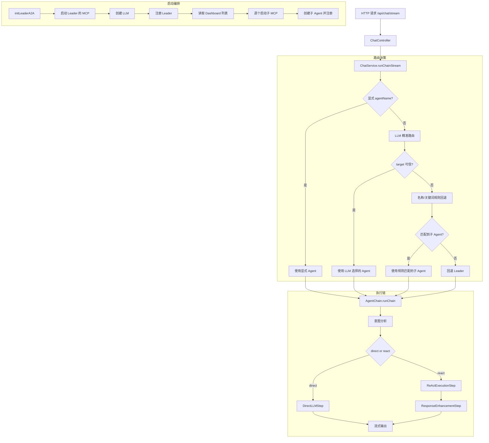

## A2A 路由与启动流程

```mermaid
flowchart TD
  A[HTTP 请求 /api/chat/stream] --> B[ChatController]
  B --> C[ChatService.runChainStream]

  subgraph 路由决策
    C --> D{显式 agentName?}
    D -- 是 --> E[使用显式 Agent]
    D -- 否 --> F[LLM 精准路由]
    F --> G{target 可信?}
    G -- 是 --> H[使用 LLM 选择的 Agent]
    G -- 否 --> I[名称/关键词规则回退]
    I --> J{匹配到子 Agent?}
    J -- 是 --> K[使用规则匹配的子 Agent]
    J -- 否 --> L[回退 Leader]
  end

  subgraph 执行链
    H --> M[AgentChain.runChain]
    E --> M
    K --> M
    L --> M
    M --> N[意图分析]
    N --> O{direct or react}
    O -- direct --> P[DirectLLMStep]
    O -- react --> Q[ReActExecutionStep]
    Q --> R[ResponseEnhancementStep]
    P --> S[流式输出]
    R --> S
  end

  subgraph 启动编排
    T[initLeaderA2A] --> U[启动 Leader 的 MCP]
    U --> V[创建 LLM]
    V --> W[注册 Leader]
    W --> X[读取 Dashboard 列表]
    X --> Y[逐个启动子 MCP]
    Y --> Z[创建子 Agent 并注册]
  end
```

