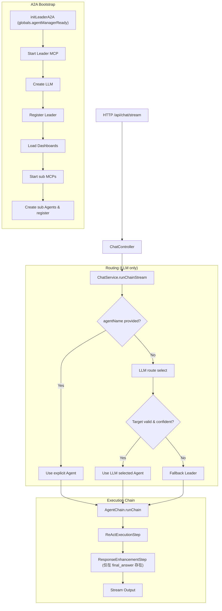

## A2A 路由与启动流程

```mermaid
flowchart TB
  %% Entry
  A["HTTP /api/chat/stream"] --> B["ChatController"]
  B --> C["ChatService.runChainStream"]

  %% Routing (LLM only)
  subgraph ROUTE["Routing (LLM only)"]
    C --> D{"agentName provided?"}
    D -- "Yes" --> E["Use explicit Agent"]
    D -- "No"  --> F["LLM route select"]
    F --> G{"Target valid & confident?"}
    G -- "Yes" --> H["Use LLM selected Agent"]
    G -- "No"  --> L["Fallback Leader"]
  end

  %% Execution Chain
  subgraph EXEC["Execution Chain"]
    H --> M["AgentChain.runChain"]
    E --> M
    L --> M
    M --> Q["ReActExecutionStep"]
    Q --> R["ResponseEnhancementStep (仅在 final_answer 存在)"]
    R --> S["Stream Output"]
  end

  %% Bootstrap
  subgraph BOOT["A2A Bootstrap"]
    direction TB
    T["initLeaderA2A (globals.agentManagerReady)"] --> U["Start Leader MCP"]
    U --> V["Create LLM"]
    V --> W["Register Leader"]
    W --> X["Load Dashboards"]
    X --> Y["Start sub MCPs"]
    Y --> Z["Create sub Agents & register"]
  end
```
