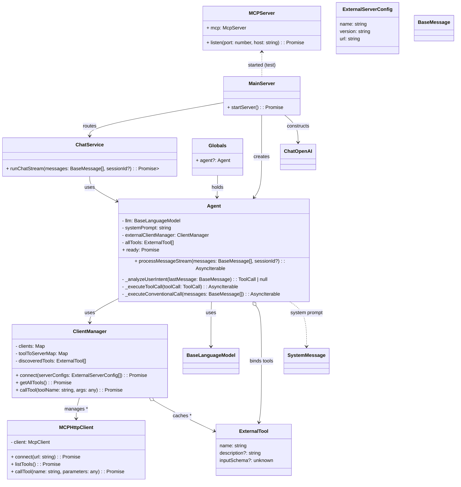

## Agent 架构 UML 类图

下图展示了核心类之间的关系与职责边界（Agent、ClientManager、MCP 客户端/服务器、服务与入口等）。

说明：
- Agent 负责协调 LLM 与工具调用，暴露流式处理接口，并在构造后异步完成外部工具初始化（`ready`）。
- ClientManager 统一管理多个 MCP 客户端，发现并缓存工具列表，提供按工具名路由的调用能力。
- MCPServer 作为示例外部工具服务由入口进程启动，Agent 通过 HTTP MCP 协议访问。
- `MainServer` 初始化 LLM、Agent、路由与中间件；`ChatService` 面向控制器聚合对 Agent 的调用。

