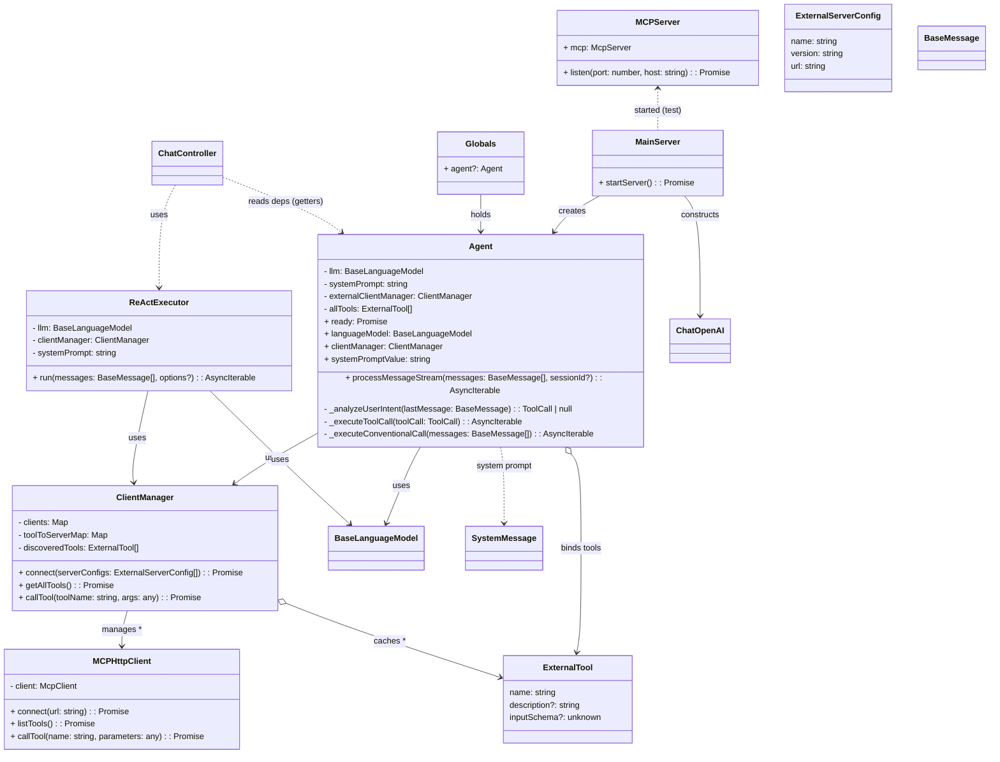

## Agent 架构 UML 类图

下图展示了核心类之间的关系与职责边界（Agent、ClientManager、MCP 客户端/服务器、服务与入口等）。

说明：
- 现已由 `ChatController` 直接使用 `ReActExecutor` 驱动“多步多工具”的 ReAct 流程；通过 `globals.agent` 暴露的只读 getter 复用同一 `LLM`/`ClientManager`/`systemPrompt`。
- `Agent` 仍保留原单步能力与工具绑定逻辑（兼容/参考），但默认接口已切换到 ReAct。
- `ClientManager` 统一管理多个 MCP 客户端；`MCPServer` 为示例外部工具服务，采用 Streamable HTTP 传输。

