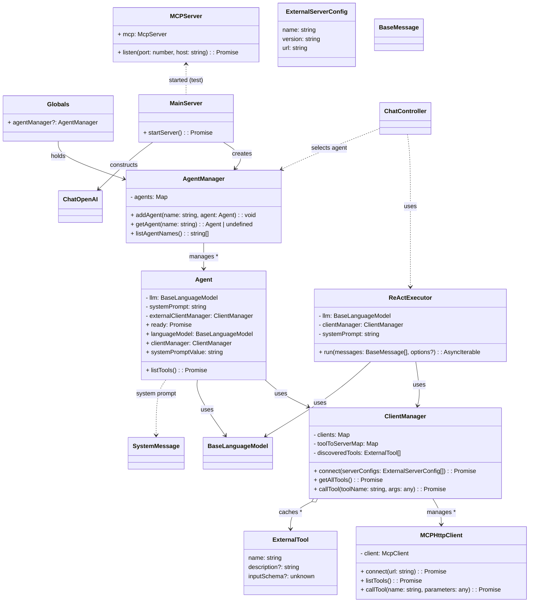

## Agent 架构 UML 类图

下图展示了核心类之间的关系与职责边界（Agent、AgentManager、ClientManager、MCP 客户端/服务器、服务与入口等）。

说明：
- `ChatController` 通过 `ChatService` 调用 `AgentManager.getAgent(agentName)` 选择具体 Agent，再用 `ReActExecutor` 驱动 ReAct 流程。
- `Agent` 负责提供 `LLM`、`ClientManager`、`systemPrompt` 等依赖，不再缓存 `allTools`。
- `ClientManager` 统一管理多个 MCP 客户端；`MCPServer` 为示例外部工具服务，采用 Streamable HTTP 传输。

