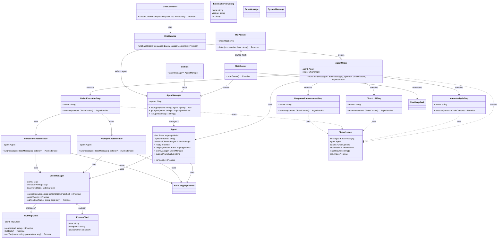

## Agent 架构 UML 类图

下图展示了核心类之间的关系与职责边界（Agent、AgentManager、AgentChain、链式步骤、MCP 客户端/服务器、服务与入口等）。



### 架构说明

#### 核心组件职责

1. **Agent**: 核心依赖提供者，负责提供LLM、MCP客户端和系统提示词
2. **AgentManager**: 管理多个Agent实例，支持多Agent场景
3. **AgentChain**: 链式处理器，协调各个处理步骤的执行
4. **链式步骤**: 
   - `IntentAnalysisStep`: 意图分析，判断是否需要工具调用
   - `DirectLLMStep`: 直接LLM回答，用于简单问答
   - `ReActExecutionStep`: ReAct执行，处理复杂工具调用
   - `ResponseEnhancementStep`: 响应增强，优化最终输出

#### 处理流程

```
用户请求 → ChatController → ChatService → AgentChain
    ↓
AgentChain.runChain()
    ↓
IntentAnalysisStep (意图分析)
    ↓
分支判断:
├─ 直接回答 → DirectLLMStep → 输出结果
└─ 工具调用 → ReActExecutionStep → ResponseEnhancementStep → 输出结果
```

#### 关键特性

- **模块化设计**: Agent模块可独立打包和部署
- **链式处理**: 支持可扩展的处理步骤
- **多执行策略**: 支持Prompt和Function两种ReAct模式
- **流式输出**: 完整的异步流式处理
- **MCP集成**: 自动发现和调用外部工具

