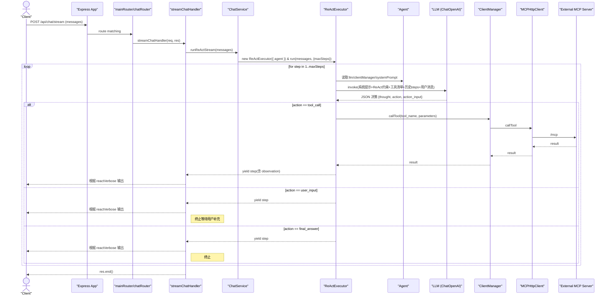

## /api/chat/stream 调用流程（ReAct 模式）

```mermaid
sequenceDiagram
  actor Client as "Client"
  participant Express as "Express App"
  participant Router as "mainRouter/chatRouter"
  participant Controller as "streamChatHandler"
  participant Service as "ChatService"
  participant ReAct as "ReActExecutor"
  participant Agent as "Agent"
  participant LLM as "LLM (ChatOpenAI)"
  participant CM as "ClientManager"
  participant MCP as "MCPHttpClient"
  participant Ext as "External MCP Server"

  Client->>Express: POST /api/chat/stream (messages)
  Express->>Router: route matching
  Router->>Controller: streamChatHandler(req, res)
  Controller->>Service: runReActStream(messages)
  Service->>ReAct: new ReActExecutor({ agent }) & run(messages, {maxSteps})

  loop for step in 1..maxSteps
    ReAct->>Agent: 读取 llm/clientManager/systemPrompt
    ReAct->>LLM: invoke(系统提示+ReAct约束+工具清单+历史steps+用户消息)
    LLM-->>ReAct: JSON 决策 {thought, action, action_input}
    alt action == tool_call
      ReAct->>CM: callTool(tool_name, parameters)
      CM->>MCP: callTool
      MCP->>Ext: /mcp
      Ext-->>MCP: result
      MCP-->>CM: result
      CM-->>ReAct: result
      ReAct-->>Controller: yield step(含 observation)
      Controller-->>Client: 根据 reactVerbose 输出
    else action == user_input
      ReAct-->>Controller: yield step
      Controller-->>Client: 根据 reactVerbose 输出
      Note right of Controller: 终止等待用户补充
    else action == final_answer
      ReAct-->>Controller: yield step
      Controller-->>Client: 根据 reactVerbose 输出
      Note right of Controller: 终止
    end
  end

  Controller-->>Client: res.end()
```

