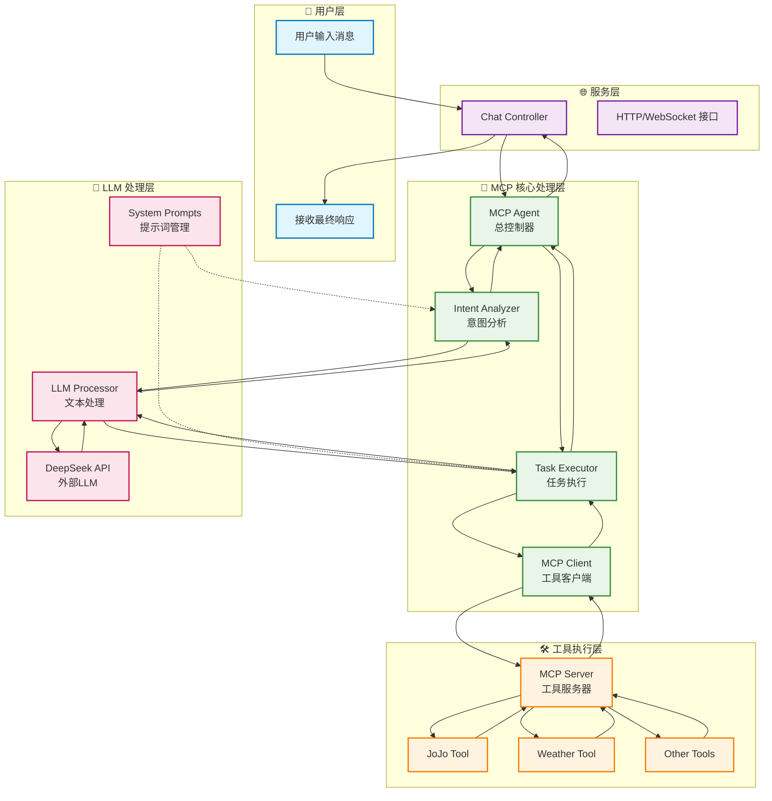
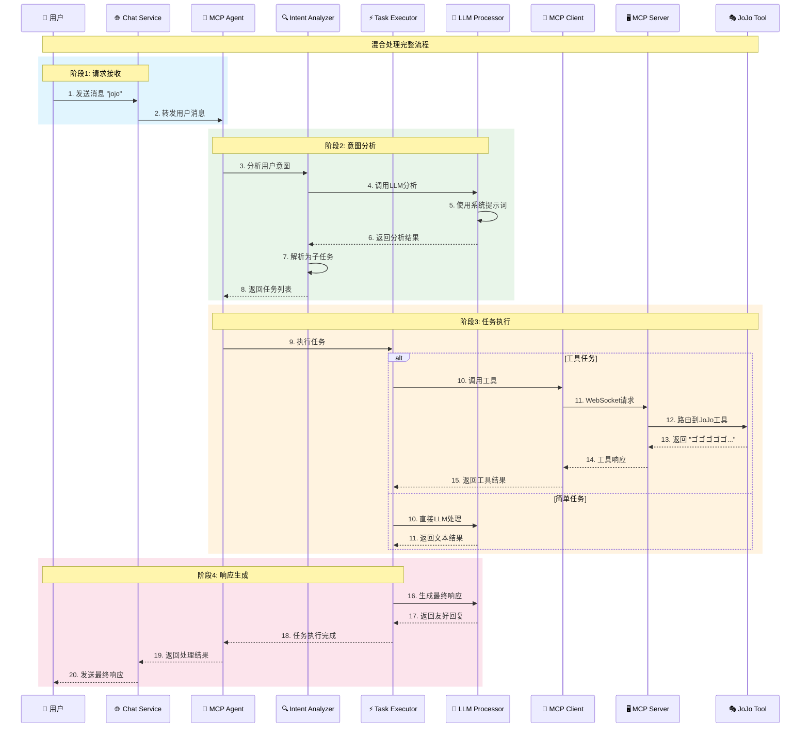
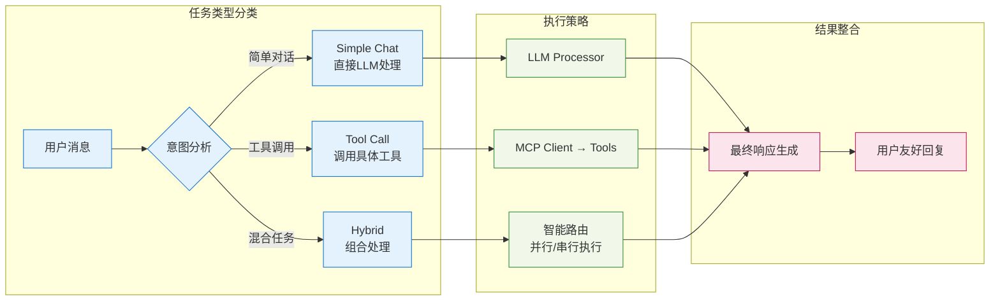

# MCP 混合处理架构流程图

## 系统架构概览



## 详细处理流程



## 核心组件职责

### 🧠 MCP Agent (总控制器)
- 协调整个处理流程
- 管理组件间通信
- 处理错误和降级

### 🔍 Intent Analyzer (意图分析器)
- 分析用户消息意图
- 分解复杂请求为子任务
- 确定任务类型和优先级

### ⚡ Task Executor (任务执行器)
- 执行不同类型的任务
- 支持并行和串行执行
- 整合多个任务结果

### 🤖 LLM Processor (LLM处理器)
- 与外部LLM API交互
- 管理提示词模板
- 处理文本生成和解析

### 📡 MCP Client (工具客户端)
- 与工具服务器通信
- 管理WebSocket连接
- 处理工具调用请求

### 🖥️ MCP Server (工具服务器)
- 管理工具注册和路由
- 处理工具调用请求
- 返回工具执行结果

## 任务类型处理



## 关键特性

### ✨ 智能意图识别
- 自动识别用户真实意图
- 支持复杂多步骤请求
- 上下文感知分析

### 🔄 混合处理模式
- 简单对话直接LLM处理
- 工具调用自动路由
- 混合任务智能分解

### 🛠️ 可扩展工具系统
- 标准化工具接口
- 动态工具注册
- WebSocket实时通信

### 📝 集中化提示词管理
- 模板化提示词
- 多语言支持
- 易于维护和更新

## 数据流示例

### JoJo工具调用示例
```
用户输入: "jojo"
↓
意图分析: 识别为工具调用任务
↓
任务执行: 调用JoJo工具
↓
工具响应: "ゴゴゴゴゴ..."
↓
最终回复: "ロードローラーだ！(ROAD ROLLER DA!) —— 看来你提到《JoJo的奇妙冒险》了呢！..."
```

### 混合任务示例
```
用户输入: "你好，请调用jojo工具"
↓
意图分析: 识别为混合任务 (问候 + 工具调用)
↓
任务分解: [简单对话任务, 工具调用任务]
↓
并行执行: 生成问候回复 + 调用JoJo工具
↓
结果整合: 合并两个任务的结果
↓
最终回复: 友好的问候 + JoJo相关内容
```
