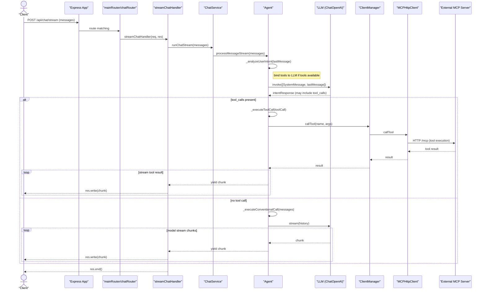

## /api/chat/stream 调用流程

```mermaid
sequenceDiagram
  actor Client as "Client"
  participant Express as "Express App"
  participant Router as "mainRouter/chatRouter"
  participant Controller as "streamChatHandler"
  participant Service as "ChatService"
  participant Agent as "Agent"
  participant LLM as "LLM (ChatOpenAI)"
  participant CM as "ClientManager"
  participant MCP as "MCPHttpClient"
  participant Ext as "External MCP Server"

  Client->>Express: POST /api/chat/stream (messages)
  Express->>Router: route matching
  Router->>Controller: streamChatHandler(req, res)
  Controller->>Service: runChatStream(messages)
  Service->>Agent: processMessageStream(messages)

  Agent->>Agent: _analyzeUserIntent(lastMessage)
  Note right of Agent: bind tools to LLM if tools available
  Agent->>LLM: invoke([SystemMessage, lastMessage])
  LLM-->>Agent: intentResponse (may include tool_calls)

  alt tool_calls present
    Agent->>Agent: _executeToolCall(toolCall)
    Agent->>CM: callTool(name, args)
    CM->>MCP: callTool
    MCP->>Ext: HTTP /mcp (tool execution)
    Ext-->>MCP: tool result
    MCP-->>CM: result
    CM-->>Agent: result
    loop stream tool result
      Agent-->>Controller: yield chunk
      Controller-->>Client: res.write(chunk)
    end
  else no tool call
    Agent->>Agent: _executeConventionalCall(messages)
    Agent->>LLM: stream(history)
    loop model stream chunks
      LLM-->>Agent: chunk
      Agent-->>Controller: yield chunk
      Controller-->>Client: res.write(chunk)
    end
  end

  Controller-->>Client: res.end()
```

