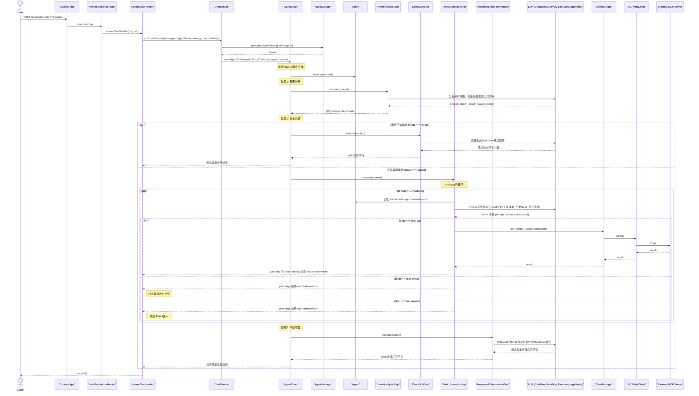

## /api/chat/stream 调用流程（链式处理模式）

### 概述
当前系统采用链式处理架构，包含意图分析、分支执行和响应增强三个主要阶段。

### 处理流程

### 关键特性

#### 1. 智能意图分析
- 自动判断用户是否需要工具调用
- 支持直接回答和工具调用两种模式
- 减少不必要的工具调用开销

#### 2. 分支执行策略
- **直接回答**: 适用于知识问答、总结等场景
- **工具调用**: 适用于需要外部数据的复杂任务

#### 3. 响应增强
- 将ReAct执行结果转换为用户友好的格式
- 保持专业性和准确性
- 使用Markdown格式输出

#### 4. 流式处理
- 支持实时流式输出
- 可配置是否显示详细ReAct步骤
- 支持超时和错误处理

### 配置选项

| 参数 | 类型 | 默认值 | 说明 |
|------|------|--------|------|
| `maxSteps` | number | 8 | ReAct最大执行步数 |
| `strategy` | string | 'prompt' | 执行策略：'prompt' 或 'function' |
| `reactVerbose` | boolean | false | 是否输出详细ReAct步骤 |
| `agentName` | string | 'main-agent' | 选择要执行的Agent |

### 错误处理

- **Agent未初始化**: 等待初始化完成
- **Agent不存在**: 返回错误信息
- **工具调用失败**: 记录日志并继续执行
- **LLM调用失败**: 支持策略回退（Function → Prompt）

