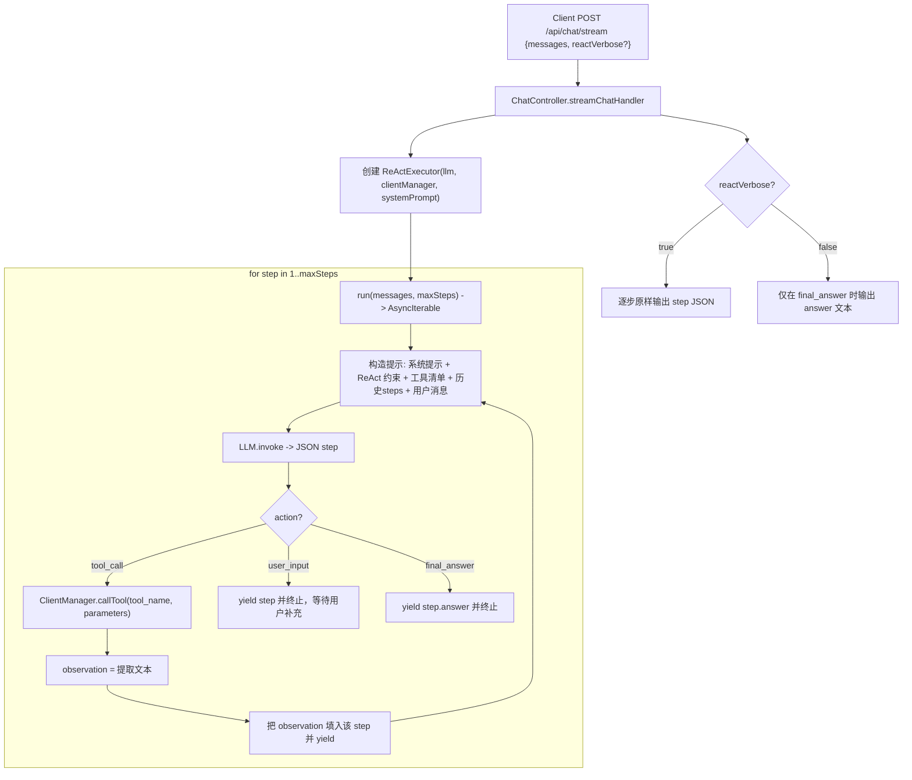

## ReAct 模式执行流

### 概述
`ReActExecutor` 将“思考-行动-观测”循环落地：模型在每一步输出一个严格的 JSON 决策，我们据此选择是否调用工具、记录观测，并将该决策流式返回，直到输出最终答案。

### 入口
- HTTP: `POST /api/chat/stream`
  - 入参：`{ messages: BaseMessage[], reactVerbose?: boolean }`
  - 当 `reactVerbose=false`（默认）：仅把最终答案写回客户端；当为 `true`：逐步回传完整 ReAct JSON。

### 关键组件
- `src/controllers/chat.controller.ts`：将请求切换到 ReAct 执行器，按 `reactVerbose` 控制输出。
- `src/agent/react/react-executor.ts`：核心循环，驱动 LLM 决策与工具调用。
- `src/agent/agent.ts`：提供 `languageModel`、`clientManager`、`systemPromptValue` 给执行器复用。

### 执行步骤（文字）
1. 控制器构造 `ReActExecutor`，传入 LLM、`ClientManager` 与系统提示。
2. 执行器进入最多 `maxSteps` 的循环：
   - 构造提示：系统提示 + ReAct 产出约束 + 工具清单 + 历史步骤 + 用户消息。
   - 调用 LLM 得到一步 JSON 决策（`thought`、`action`、`action_input`）。
   - 若 `action=tool_call`：使用 `ClientManager.callTool(tool_name, parameters)` 执行，提取文本作为 `observation` 写回该步骤。
   - 若 `action=user_input`：将该步骤返回并终止（等待用户补充）。
   - 若 `action=final_answer`：返回最终答案并终止。
3. 控制器按 `reactVerbose`：
   - `true`：逐步回传每个 JSON；
   - `false`：仅回传最终 `answer`。

### 流程图

### 相关文件
- `src/controllers/chat.controller.ts`
- `src/agent/react/react-executor.ts`
- `src/agent/agent.ts`

