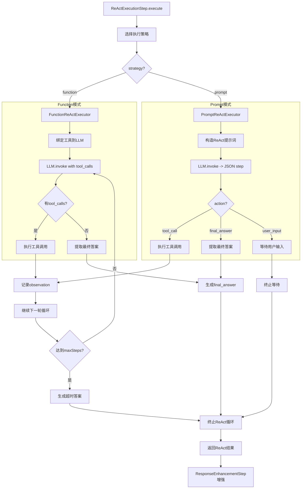

## ReAct 模式执行流（链式处理架构）

### 概述
当前系统采用链式处理架构，ReAct执行是其中的一个重要步骤。完整的处理流程为：**意图分析 → 分支执行 → 响应增强**。

### 完整处理流程

### ReAct执行详细流程

#### 入口
- HTTP: `POST /api/chat/stream`
  - 入参：`{ messages: BaseMessage[], reactVerbose?: boolean, strategy?: string }`
  - 当 `reactVerbose=false`（默认）：仅把最终增强后的答案写回客户端
  - 当为 `true`：逐步回传完整 ReAct JSON 步骤

#### 关键组件
- `src/controllers/chat.controller.ts`：按 `agentName` 选择 Agent，按 `reactVerbose` 控制输出
- `src/agent/chain/agent-chain.ts`：主链式处理器，协调各个步骤
- `src/agent/chain/steps/react-execution.ts`：ReAct执行步骤，驱动 LLM 决策与工具调用
- `src/agent/executors/*.ts`：底层执行器，支持Prompt和Function两种模式
- `src/agent/agent.ts`：提供 `languageModel`、`clientManager`、`systemPromptValue` 给执行器复用

#### ReAct执行步骤（文字）
1. **意图分析阶段**：`IntentAnalysisStep` 分析用户消息，判断是否需要工具调用
2. **ReAct执行阶段**：如果需要工具调用，`ReActExecutionStep` 进入最多 `maxSteps` 的循环：
   - 构造提示：系统提示 + ReAct 产出约束 + 工具清单 + 历史步骤 + 用户消息
   - 调用 LLM 得到一步 JSON 决策（`thought`、`action`、`action_input`）
   - 若 `action=tool_call`：使用 `ClientManager.callTool(tool_name, parameters)` 执行，提取文本作为 `observation` 写回该步骤
   - 若 `action=user_input`：将该步骤返回并终止（等待用户补充）
   - 若 `action=final_answer`：返回最终答案并终止
3. **响应增强阶段**：`ResponseEnhancementStep` 将ReAct执行结果转换为用户友好的Markdown格式
4. **输出控制**：控制器按 `reactVerbose` 配置决定输出内容

#### ReAct执行流程图

### 执行策略对比

| 特性 | Prompt模式 | Function模式 |
|------|------------|--------------|
| **兼容性** | 所有支持JSON输出的模型 | 仅支持Function Calling的模型 |
| **Token效率** | 中等 | 高 |
| **结构化程度** | 依赖提示词约束 | 原生结构化 |
| **错误处理** | 需要解析JSON | 自动处理 |
| **回退机制** | 无 | 自动回退到Prompt模式 |

### 相关文件
- `src/controllers/chat.controller.ts`
- `src/agent/chain/agent-chain.ts`
- `src/agent/chain/steps/react-execution.ts`
- `src/agent/chain/steps/intent-analysis.ts`
- `src/agent/chain/steps/response-enhancement.ts`
- `src/agent/executors/promptBaseToolUse.ReAct.ts`
- `src/agent/executors/functionCalling.ReAct.ts`
- `src/agent/agent.ts`

### 配置选项

| 参数 | 类型 | 默认值 | 说明 |
|------|------|--------|------|
| `maxSteps` | number | 8 | ReAct最大执行步数 |
| `strategy` | string | 'prompt' | 执行策略：'prompt' 或 'function' |
| `reactVerbose` | boolean | false | 是否输出详细ReAct步骤 |

### 错误处理机制

1. **Function模式失败回退**：自动回退到Prompt模式
2. **工具调用失败**：记录错误日志，继续执行
3. **LLM调用失败**：非首轮失败时生成错误步骤
4. **超时处理**：达到maxSteps时生成超时答案

