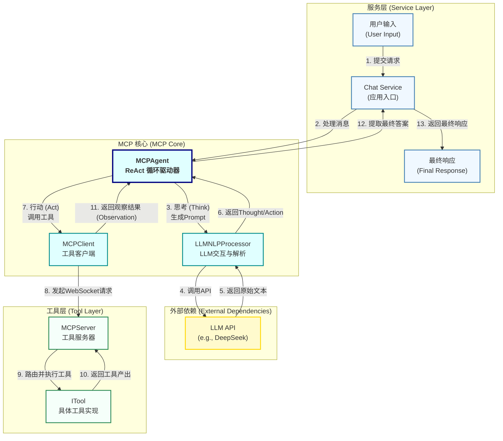

# MCP (Model-Context-Protocol) 模块

MCP 是一个为语言模型设计的、可扩展的、基于工具的执行框架。其核心思想是赋予 LLM Agent **“思考”** 和 **“行动”** 的能力，使其能够通过调用外部工具来完成复杂的用户请求。

## 核心理念：ReAct (Reasoning and Acting)

本模块完全基于 **ReAct** 设计模式。这意味着 Agent 的每一次决策都遵循一个清晰的循环：

1.  **思考 (Thought)**：基于当前的用户请求和历史记录，Agent (通过 LLM) 进行推理，分析问题并制定下一步的行动计划。
2.  **行动 (Action)**：Agent 决定调用哪一个工具，并准备好调用它所需的参数。
3.  **观察 (Observation)**：Agent 执行工具并获得返回结果。这个结果就是“观察”到的新信息。
4.  **重新思考**：Agent 将新的观察结果加入到历史记录中，然后重复第一步，根据新信息进行下一轮的思考和行动，直到任务完成或达到最大迭代次数。

这种模式使 Agent 能够处理多步骤、需要依赖外部信息的复杂任务，而不仅仅是进行简单的问答。

## 架构图



## 主要组件

*   **`MCPAgent` (`agent/mcp-agent.ts`)**
    *   **职责**: ReAct 流程的“大脑”和总指挥。它负责驱动整个思考-行动循环，管理与 LLM 和工具的交互。
    *   **核心方法**: `processMessage()`，这是整个流程的入口。

*   **`LLMNLPProcessor` (`llm/processor.ts`)**
    *   **职责**: 与大语言模型 (LLM) API 的直接交互层。它负责根据 Agent 构建的 Prompt 生成文本（即 Agent 的“思考”过程）。
    *   **核心方法**: `generateText()`。

*   **`MCPClient` (`client/mcp-client.ts`)**
    *   **职责**: 作为 Agent 的“手臂”，通过 WebSocket 与工具服务器 (`MCPServer`) 通信。它负责发现、连接和调用远程工具。
    *   **核心方法**: `callTool()`。

*   **`MCPServer` (`servers/default/mcp-server.ts`)**
    *   **职责**: 一个 WebSocket 服务器，用于托管和暴露一个或多个工具。它接收来自 `MCPClient` 的请求，并将它们路由到正确的工具上执行。

*   **`ITool` (`servers/base-tool.ts`)**
    *   **职责**: 这是工具实现的接口。所有具体的工具（例如 `JojoTool`）都必须实现这个接口，定义工具的名称、描述、参数和执行逻辑。

*   **`ServerManager` (`servers/manager.ts`)**
    *   **职责**: 自动发现和管理项目中的所有 `MCPServer` 实例，简化了服务器的启动和停止过程。

## 实践指南

### 1. 初始化和使用 Agent

通常在应用的主入口（如 `index.ts`）进行初始化。

```typescript
// 在你的服务启动逻辑中
import { MCPAgent } from './mcp/index.js';

// 1. 创建Agent实例
const agent = new MCPAgent({
  // 在这里可以覆盖默认配置, 比如LLM的API Key
  llm: {
    apiKey: process.env.YOUR_LLM_API_KEY
  }
});

// 2. 异步初始化Agent
await agent.initialize();

// 3. 在处理用户请求的地方调用
async function handleUserMessage(message: string) {
  const response = await agent.processMessage(message, {
    sessionId: 'some-session-id', 
    messages: [] 
  });
  
  if (response.error) {
    console.error("Agent Error:", response.error);
    return message; // or some fallback response
  }
  
  return response.enhancedMessage; // 这是Agent的最终答案
}
```

### 2. 如何添加一个新工具

这是扩展 Agent能力的核心。遵循以下三步：

**第一步：创建工具文件**

在 `src/mcp/servers/default/` 目录下创建一个新文件，例如 `my-new-tool.ts`。

```typescript
import { BaseTool } from '../base-tool.js';
import { ToolParameters, ToolResult } from '../../types/index.js';

export class MyNewTool extends BaseTool {
  name = 'my_new_tool';
  description = '这是一个新工具的描述，告诉LLM它能做什么。';
  
  // 定义工具需要的参数
  parameters = {
    type: 'object',
    properties: {
      query: {
        type: 'string',
        description: '需要查询的具体内容',
      },
      isUrgent: {
        type: 'boolean',
        description: '这个任务是否紧急',
      }
    },
    required: ['query'],
  };

  // 工具的核心执行逻辑
  async _call(args: ToolParameters): Promise<ToolResult> {
    const { query, isUrgent } = args;

    console.log(`Executing MyNewTool with query: ${query} and urgency: ${isUrgent}`);

    // 在这里执行你的逻辑，例如查询数据库、调用API等
    const resultData = `This is the result for query '${query}'.`;
    
    return {
      success: true,
      data: resultData,
      // 如果这个工具的结果就是最终答案，设置 isFinal 为 true
      isFinal: true 
    };
  }
}
```

**第二步：在服务器中注册工具**

打开 `src/mcp/servers/default/mcp-server.ts`，导入并注册你的新工具。

```typescript
// mcp-server.ts
import { ToolRegistry } from '../tool-registry.js';
import { JojoTool } from './jojo-tool.js';
import { MyNewTool } from './my-new-tool.js'; // <--- 1. 导入你的新工具

// ...

// 在 'createDefaultToolRegistry' 函数中
function createDefaultToolRegistry(): ToolRegistry {
  const registry = new ToolRegistry();
  registry.registerTool(new JojoTool());
  registry.registerTool(new MyNewTool()); // <--- 2. 注册新工具实例
  return registry;
}
```

**第三步：重启应用**

完成以上两步后，重新启动你的应用程序。`ServerManager` 和 `MCPClient` 会自动发现、启动并连接到包含新工具的服务器。Agent 在下一次“思考”时，就会在工具列表中看到 `my_new_tool` 并学会如何使用它。 
