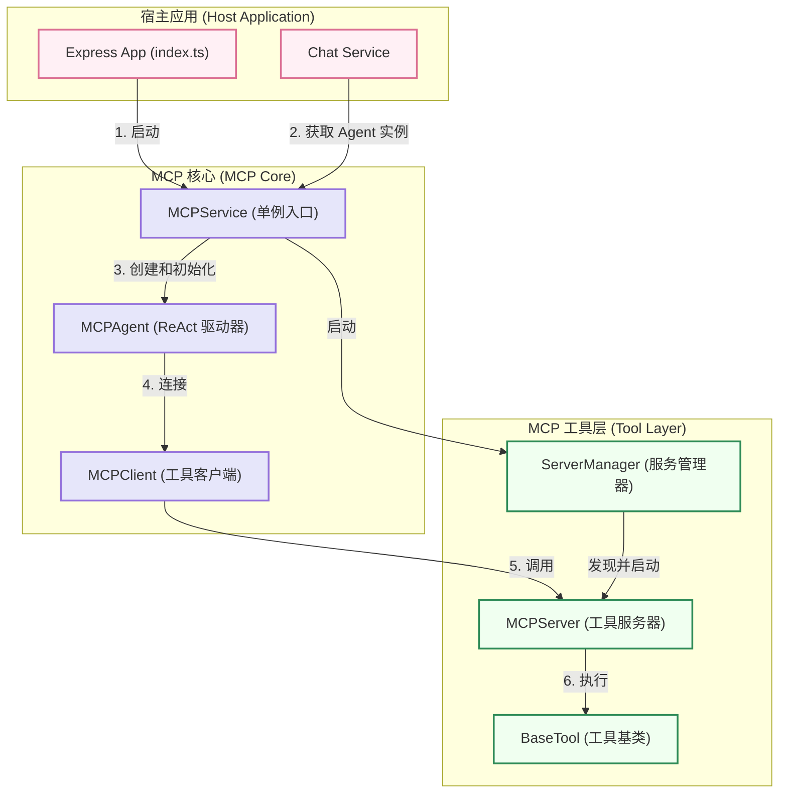

# MCP (Model-Context-Protocol) 模块

MCP 是一个为语言模型设计的、可扩展的、基于工具的执行框架。其核心思想是赋予 LLM Agent **“思考”** 和 **“行动”** 的能力，使其能够通过调用外部工具来完成复杂的用户请求。

## 核心理念：ReAct (Reasoning and Acting)

本模块完全基于 **ReAct** 设计模式。这意味着 Agent 的每一次决策都遵循一个清晰的循环：

1.  **思考 (Thought)**：基于当前的用户请求和历史记录，Agent (通过 LLM) 进行推理，分析问题并制定下一步的行动计划。
2.  **行动 (Action)**：Agent 决定调用哪一个工具，并准备好调用它所需的参数。
3.  **观察 (Observation)**：Agent 执行工具并获得返回结果。这个结果就是“观察”到的新信息。
4.  **重新思考**：Agent 将新的观察结果加入到历史记录中，然后重复第一步，根据新信息进行下一轮的思考和行动，直到任务完成。

## 架构图



## 主要组件

*   **`MCPService` (`service.ts`)**
    *   **职责**: **模块的统一入口**。这是一个单例服务，负责管理整个 `mcp` 模块的生命周期（`start`/`stop`）。它创建并持有了 `MCPAgent` 的唯一实例，确保了整个应用中 Agent 的一致性。
    *   **核心方法**: `getInstance()`, `start()`, `getAgent()`。

*   **`MCPAgent` (`agent/mcp-agent.ts`)**
    *   **职责**: ReAct 流程的“大脑”和总指挥。它负责驱动整个思考-行动循环，管理与 LLM 和工具的交互。
    *   **核心方法**: `processMessageStream()`。

*   **`ServerManager` (`servers/manager.ts`)**
    *   **职责**: **工具服务器的“看守者”**。它在 `MCPService` 启动时被调用，负责自动扫描 `src/mcp/servers` 目录，发现并启动所有工具服务器实例。

*   **`MCPServer` (`servers/default/mcp-server.ts`)**
    *   **职责**: 一个 WebSocket 服务器，用于托管和暴露一个或多个工具。它接收来自 `MCPClient` 的请求，并将它们路由到正确的工具上执行。

*   **`MCPClient` (`client/mcp-client.ts`)**
    *   **职责**: 作为 Agent 的“手臂”，通过 WebSocket 与 `MCPServer` 通信。

*   **`BaseTool` (`servers/base-tool.ts`)**
    *   **职责**: 所有具体工具的**抽象基类**。它统一了工具的定义，包含了 `name`, `description`, `parameters`, `keywords` 等核心属性。

## 实践指南

### 1. 初始化和使用

得益于 `MCPService` 的封装，初始化流程现在非常简洁。

```typescript
// 在你的应用主入口，如 src/index.ts

import { MCPService } from './mcp/service.js';
import { getDefaultConfig } from './mcp/config/index.js';

async function startServer() {
  // 1. 获取一份默认配置
  const mcpConfig = getDefaultConfig();
  
  // 2. 用环境变量覆盖关键配置
  mcpConfig.llm.apiKey = process.env.LLM_API_KEY || '';
  // ... 其他配置覆盖

  // 3. 一行代码启动整个 MCP 模块
  await MCPService.getInstance().start(mcpConfig);

  // ... 启动你的 Express 或其他应用
}

startServer();
```

在需要使用 Agent 的地方（例如 `ChatService`），通过 `MCPService` 获取单例：

```typescript
// 在 src/services/chat/chat.service.ts

import { MCPService } from '../../mcp/service.js';

class ChatService {
  private getAgent(): MCPAgent | null {
    try {
      // 在需要时才获取 Agent 实例
      return MCPService.getInstance().getAgent();
    } catch (error) {
      return null;
    }
  }
  
  public async handleMessage(message: string) {
    const agent = this.getAgent();
    if (agent) {
       // 使用 agent ...
    }
  }
}
```

### 2. 如何添加一个新工具

**得益于 `ServerManager` 的自动化机制，添加新工具现在只需要一步。**

**唯一步骤：创建工具文件**

在 `src/mcp/servers/default/` 目录下创建一个新文件，**文件名必须以 `.tool.ts` 结尾** (例如: `weather.tool.ts`)。

```typescript
// src/mcp/servers/default/weather.tool.ts

import { BaseTool } from '../base-tool.js';
import { ToolParameters, ToolResult } from '../../types/index.js';

// 1. 确保你的工具类是默认导出 (export default)
export default class WeatherTool extends BaseTool {
  constructor() {
    super(
      // 工具名称
      'get_weather',
      
      // 工具描述 (给LLM看)
      '获取指定城市的实时天气信息',
      
      // 工具参数定义
      {
        type: 'object',
        properties: {
          city: {
            type: 'string',
            description: '城市名称，例如 "北京" 或 "上海"',
          },
        },
        required: ['city'],
      },

      // 2. (可选) 定义触发关键词 (给快速检测逻辑看)
      ['天气', 'weather', '气温', '下雨']
    );
  }

  // 3. 实现核心执行逻辑
  protected async _execute(params: ToolParameters): Promise<ToolResult> {
    const { city } = params;

    // 在这里调用真实的外部天气API...
    const weatherData = `城市 ${city} 的天气是晴朗，25摄氏度。`;
    
    return {
      success: true,
      data: weatherData,
    };
  }
}
```

**完成！**

你不需要再手动注册或修改任何其他文件。`ServerManager` 会在下次应用启动时自动发现、加载并注册你的新工具。`MCPAgent` 也会自动将新工具及其关键词纳入自己的知识库中。
