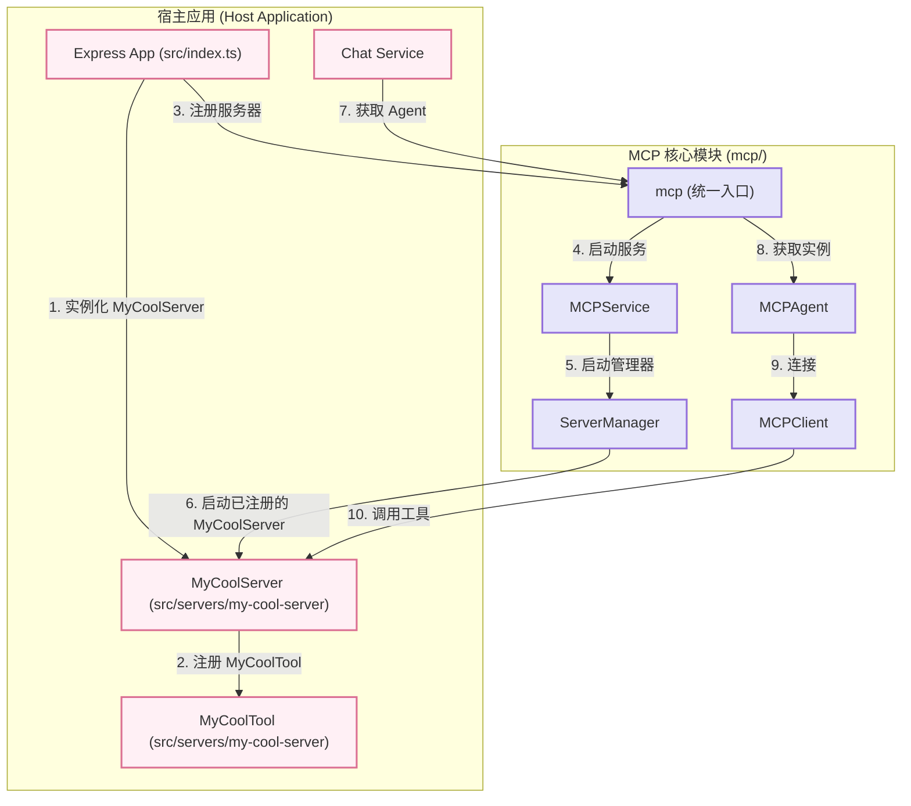

# MCP (Model-Context-Protocol) 模块

MCP 是一个为语言模型设计的、可扩展的、基于工具的执行框架。其核心思想是赋予 LLM Agent **“思考”** 和 **“行动”** 的能力，使其能够通过调用外部工具来完成复杂的用户请求。

## 核心理念：ReAct (Reasoning and Acting)

本模块完全基于 **ReAct** 设计模式。这意味着 Agent 的每一次决策都遵循一个清晰的循环：

1.  **思考 (Thought)**：基于当前的用户请求和历史记录，Agent (通过 LLM) 进行推理，分析问题并制定下一步的行动计划。
2.  **行动 (Action)**：Agent 决定调用哪一个工具，并准备好调用它所需的参数。
3.  **观察 (Observation)**：Agent 执行工具并获得返回结果。这个结果就是“观察”到的新信息。
4.  **重新思考**：Agent 将新的观察结果加入到历史记录中，然后重复第一步，根据新信息进行下一轮的思考和行动，直到任务完成。

## 架构图



## 主要组件

*   **`mcp` (`index.ts`)**
    *   **职责**: **模块的唯一、统一入口**。所有外部应用都应该只与这个对象交互。它封装了 `service` 和 `types`，实现了高度的内聚和封装。

*   **`MCPService` (`service.ts`)**
    *   **职责**: **模块的生命周期管理器**。这是一个单例服务，负责 `start`/`stop`。它创建并持有了 `MCPAgent` 的唯一实例。

*   **`MCPAgent` (`agent/mcp-agent.ts`)**
    *   **职责**: ReAct 流程的“大脑”和总指挥。它负责驱动整个思考-行动循环。

*   **`ConfigManager` (`config/manager.ts`)**
    *   **职责**: **配置的“真理之源”**。它自动从默认配置、环境变量和外部传入的配置中加载、合并和验证配置，为整个 `mcp` 模块提供统一的配置访问点。

*   **`ServerManager` (`servers/manager.ts`)**
    *   **职责**: **工具服务器的“看守者”**。它不再扫描文件系统，而是管理通过**依赖注入**方式注册进来的所有 `MCPServer` 实例的生命周期。

*   **`MCPClient` (`client/mcp-client.ts`)**
    *   **职责**: 作为 Agent 的“手臂”，通过 WebSocket 与 `MCPServer` 通信。

*   **`MCPServer` / `BaseTool`**
    *   **注意**: 这两个组件的**具体实现**现在已经**移出** `mcp` 模块，成为**应用层**的一部分。`mcp` 模块只定义它们的接口 (`IMCPServer`, `ITool`)。

## 实践指南

### 1. 初始化和使用

得益于 `mcp` 的统一入口和 `ConfigManager` 的自动化配置，初始化流程非常简洁和清晰。

```typescript
// 在你的应用主入口，如 src/index.ts

import { mcp } from './mcp/index.js';
import { DefaultMCPServer } from './servers/default/mcp-server.js';
import { AshitaNoJoeTool } from './servers/default/ashitano-joe.tool.js';

async function startServer() {
  // 1. 在应用层，创建你的 MCPServer 实例
  const myServer = new DefaultMCPServer(
    { port: 4001, host: 'localhost' },
    [AshitaNoJoeTool] // 将工具注入服务器
  );

  // 2. 准备一个服务器注册对象数组
  const serverRegistrations = [
    { name: 'default-server', server: myServer },
    // 如果有更多服务器，继续在这里添加
  ];

  // 3. 启动 MCP 服务，注入服务器定义
  // 注意：不再需要手动管理配置，ConfigManager 会自动处理
  await mcp.service.start(undefined, serverRegistrations);

  // ... 启动你的 Express 或其他应用
}

startServer();
```

在需要使用 Agent 的地方（例如 `ChatService`），通过 `mcp` 入口获取服务和类型：

```typescript
// 在 src/services/chat/chat.service.ts

import { mcp } from '../../mcp/index.js';
import type { IMCPAgent } from '../../mcp/types/index.js';

class ChatService {
  private getAgent(): IMCPAgent | null {
    try {
      return mcp.service.getAgent();
    } catch (error) {
      return null;
    }
  }
  
  public async handleMessage(message: string) {
    const agent = this.getAgent();
    if (agent) {
       // 使用 agent ...
    }
  }
}
```

### 2. 如何添加一个新服务器和新工具

**重构后，`mcp` 模块实现了真正的控制反转 (IoC)。添加新功能不再需要修改 `mcp` 内部的任何代码。**

**步骤一：在应用层创建工具**

在项目根目录的 `src/tools/` (或任何你喜欢的地方) 创建你的工具文件。

```typescript
// src/tools/weather.tool.ts

import { BaseTool } from '../mcp/servers/base-tool.js';
import { ToolParameters, ToolResult } from '../mcp/types/index.js';

export class WeatherTool extends BaseTool {
  constructor() {
    super(
      'get_weather',
      '获取指定城市的实时天气信息',
      { /* ... parameters ... */ },
      ['天气', 'weather']
    );
  }

  protected async _execute(params: ToolParameters): Promise<ToolResult> {
    const { city } = params;
    const weatherData = `城市 ${city} 的天气是晴朗，25摄氏度。`;
    return { success: true, data: weatherData };
  }
}
```

**步骤二：在应用层创建服务器来托管工具**

在 `src/servers/` 目录下创建一个新的服务器文件。

```typescript
// src/servers/weather-server.ts

import { DefaultMCPServer } from './default/mcp-server.js'; // 可以复用默认实现
import { WeatherTool } from '../tools/weather.tool.js';

export const weatherServer = new DefaultMCPServer(
  { port: 4002, host: 'localhost' },
  [WeatherTool] // 托管新的天气工具
);
```

**步骤三：在主入口注册新服务器**

打开 `src/index.ts`，将你的新服务器实例添加到 `serverRegistrations` 数组中。

```typescript
// src/index.ts

import { mcp } from './mcp/index.js';
import { defaultServer } from './servers/default-server.js'; // 假设你已导出
import { weatherServer } from './servers/weather-server.js';

async function startServer() {
  const serverRegistrations = [
    { name: 'default-server', server: defaultServer },
    { name: 'weather-server', server: weatherServer }, // <-- 在这里注册
  ];

  await mcp.service.start(undefined, serverRegistrations);
  
  // ...
}
```

**完成！**

你的新服务器和新工具现在已经完全集成到系统中了。这种基于依赖注入的架构使得扩展变得非常灵活和清晰。

### 3. Prompt Management (提示词管理)

为了实现最大的灵活性，MCP 模块内置了一个 `PromptManager`，它允许你动态地配置和覆盖 Agent 使用的所有系统提示词。

**工作原理**:

*   `PromptManager` 在启动时会加载一套默认的提示词 (位于 `mcp/prompts/default.ts`)。
*   你可以在应用的配置文件中提供一个 `prompts` 对象，用于覆盖任何默认的提示词。
*   Agent 的核心逻辑（如意图分析、最终响应生成）会通过 `PromptManager` 来获取提示词，而不是硬编码。

**如何自定义提示词**:

在你的主配置文件 (例如，通过 `mcp.service.start(config)`) 中传入 `prompts` 字段：

```typescript
// config.ts
import { mcp } from './mcp/index.js';

const myCustomConfig: Partial<mcp.types.MCPAgentConfig> = {
  // ... 其他配置
  prompts: {
    intent_analysis: "你是一个超级厉害的意图分析师，请用最高效的方式分解任务...",
    simple_task: "你好，我是你的专属AI，请问有什么可以帮你的？"
  }
};

// 在启动时传入
await mcp.service.start(myCustomConfig, serverRegistrations);
```

你可以覆盖的提示词键值包括：`intent_analysis`, `simple_task`, `final_response`, `tool_error`。

### 4. Resource Management (资源管理)

`ResourceManager` 提供了一个统一的接口来访问外部资源，例如本地文件系统或未来的网络资源。这使得工具的实现更加干净，因为它们不需要关心具体的资源加载逻辑。

**工作原理**:

*   `ResourceManager` 采用**提供者模式** (`Provider Pattern`)。
*   目前，系统内置了一个 `FileProvider`，用于处理 `file://` 协议的资源。
*   当工具或 Agent 需要资源时，它们只需调用 `mcp.resources.getResource(uri)`。

**如何使用**:

假设你的一个工具需要读取一个本地的知识库文件。

```typescript
// src/tools/knowledge.tool.ts
import { BaseTool } from '../mcp/servers/base-tool.js';
import { mcp } from '../mcp/index.js'; // 统一入口

export class KnowledgeTool extends BaseTool {
  // ... 构造函数等

  protected async _execute(params: ToolParameters): Promise<ToolResult> {
    const { topic } = params;
    try {
      // 通过 ResourceManager 安全地获取文件内容
      const knowledgeBase = await mcp.resources.getResource('file://data/knowledge_base.txt');
      
      // ... 基于文件内容进行处理
      const answer = this.findAnswer(knowledgeBase, topic);

      return { success: true, data: answer };
    } catch (error) {
      return { success: false, error: '无法加载知识库' };
    }
  }
}
```

这种设计将资源加载的逻辑与工具的业务逻辑完全解耦，未来可以轻松地添加 `HttpProvider` 或 `DatabaseProvider` 而无需修改任何工具代码。

---
## 5. 未来工作与潜在优化

当前的 MCP 框架提供了一个坚实的基础。以下是未来增强的一些潜在方向：

### ResourceManager 优化

*   **实现 `HttpProvider`**: 创建一个提供者来处理 `http://` 和 `https://` URI，允许工具直接从 Web 获取资源。
*   **添加缓存层**: 引入一个可以包装其他提供者（如 `HttpProvider`）的缓存提供者，以缓存频繁访问的资源，从而提高性能并减少网络请求。这可以支持 TTL（生存时间）等策略。
*   **支持流式处理**: 为了处理大型资源（例如大文件或 API 响应），`load` 方法可以升级为返回 `ReadableStream`，以防止高内存消耗。

### PromptManager 优化

*   **通过 ResourceManager 加载提示**: 一个关键的改进是让 `PromptManager` 使用 `ResourceManager` 从外部文件（例如 `file://./prompts.json` 甚至 `https://.../prompts.json`）加载其提示模板。这将使提示内容与代码库完全解耦。
*   **国际化 (i18n)**: 通过扩展 `getPrompt` 以接受 `locale` 参数（例如 `en-US`）来支持多种语言。底层的提示数据结构也需要更新以存储每个提示键的翻译。
*   **版本控制**: 为提示引入版本控制系统（例如 `getPrompt('intent_analysis', { version: 'v2' })`）。这对于 A/B 测试不同的提示策略和安全回滚非常有价值。
