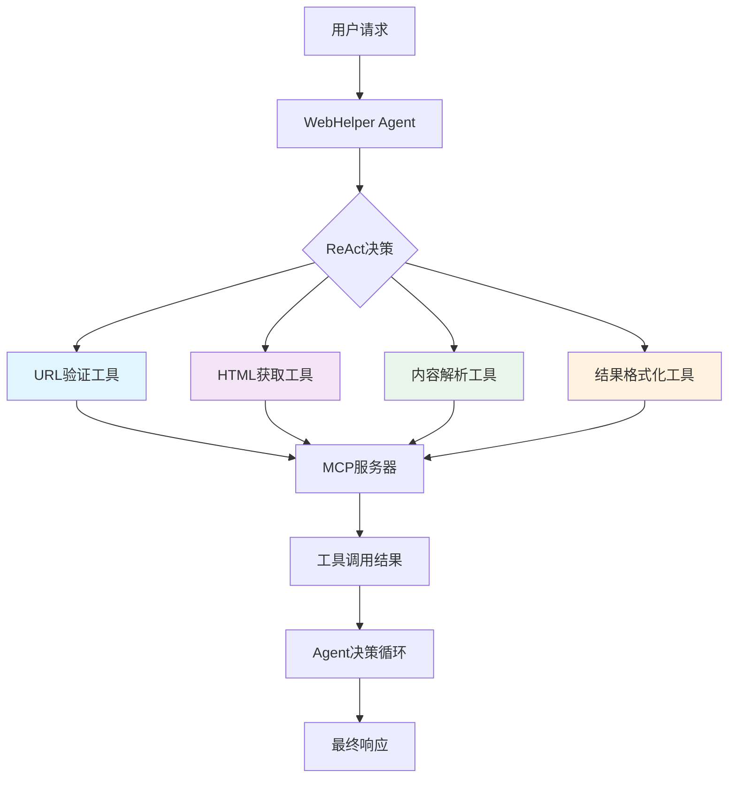
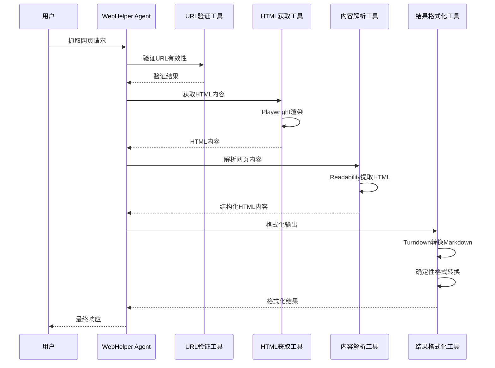

# WebCatcher - 智能网页抓取工具

## 📖 项目概述

WebCatcher 是一个基于 MCP（Model Context Protocol）架构的智能网页抓取工具集，采用模块化设计，通过多个独立的MCP工具协同工作，实现完整的网页内容抓取、解析和格式化功能。

### 🎯 核心特性

- **智能化编排**：基于LLM的ReAct决策模式，AI自主决定工具调用顺序
- **模块化架构**：四个独立MCP工具职责单一、松耦合
- **确定性工具**：工具层专注数据处理，智能决策留给Agent层
- **多浏览器支持**：基于Playwright，支持Chromium、Firefox、Safari
- **智能内容解析**：使用Readability算法提取结构化内容
- **专业格式转换**：ResultFormatter使用Turndown进行专业HTML到Markdown转换
- **多格式输出**：支持Markdown、JSON、摘要、纯文本等多种输出格式
- **统一错误处理**：完整的错误恢复机制和状态管理

## 🏗️ 设计思路

### 1. 架构原则

#### **单一职责原则**
每个MCP工具只负责一个特定功能，避免工具间耦合：
- URL验证 → `UrlValidatorTool`
- HTML获取 → `HtmlFetcherTool`
- 内容解析 → `ContentParserTool`
- 结果格式化 → `ResultFormatterTool`

#### **智能化编排 vs 预定义流水线**
- ❌ **传统方式**：固定的工具调用顺序
- ✅ **ReAct模式**：LLM基于上下文智能决策
- 🎯 **优势**：更高的灵活性和容错能力

#### **确定性工具设计**
- 工具层：执行确定性数据处理
- Agent层：负责智能决策和策略选择
- 避免双重LLM调用，提升性能

### 2. 技术选型理由

#### **Playwright vs Puppeteer**
```typescript
// Playwright优势
-更好的多浏览器支持
- 更稳定的自动化API
- 更快的页面加载性能
- 更强的网络拦截能力
- 更好的错误处理机制
```

#### **Readability + HTML原始内容**
```typescript
// 优化后的处理机制
优先使用 → Readability（智能内容提取）
原始保留 → HTML格式内容
格式转换 → 由ResultFormatter负责
```

## 🔧 实现方案

### 架构图



### 数据流图



## 📁 项目结构

```
webCatcher/
├── README.md                 # 本文档
├── index.ts                 # MCP服务器启动入口
├── types.ts                 # 类型定义和Zod验证模式
├── tools/                   # MCP工具实现
│   ├── index.ts            # 工具统一导出
│   ├── url-validator-tool.ts    # URL验证工具
│   ├── html-fetcher-tool.ts     # HTML获取工具
│   ├── content-parser-tool.ts   # 内容解析工具
│   └── result-formatter-tool.ts # 结果格式化工具
└── utils/
    └── error-handler.ts    # 统一错误处理
```

## 🛠️ 核心工具详解

### 1. URL验证工具 (UrlValidatorTool)

#### **功能职责**
- URL格式验证和规范化
- 域名有效性检查
- 网络可达性测试
- 安全性验证（协议检查）

#### **关键实现**
```typescript
// URL规范化
const normalizedUrl = new URL(url).toString()

// 网络可达性检查
const response = await fetch(url, { method: 'HEAD' })

// 安全验证
const isSecure = parsed.protocol === 'https:'
```

#### **输出示例**
```json
{
    "isValid": true,
    "normalizedUrl": "https://example.com/",
    "protocol": "https:",
    "domain": "example.com",
    "isSecure": true
}
```

### 2. HTML获取工具 (HtmlFetcherTool)

#### **功能职责**
- 统一使用Playwright处理所有网页类型
- 支持JavaScript渲染的动态网页
- 自定义用户代理和等待条件
- 完整的错误处理和重试机制

#### **关键实现**
```typescript
// 浏览器初始化
const browser = await chromium.launch({
    headless: true,
    args: ['--no-sandbox', '--disable-setuid-sandbox']
})

// 页面配置
await page.setViewportSize({ width: 1920, height: 1080 })
await page.setExtraHTTPHeaders({ 'User-Agent': userAgent })

// 智能等待
const response = await page.goto(url, { waitUntil: 'networkidle' })
```

#### **输出示例**
```json
{
    "html": "<html>...</html>",
    "contentType": "text/html",
    "statusCode": 200,
    "finalUrl": "https://example.com/",
    "loadTime": 1500,
    "metadata": {
        "title": "页面标题",
        "description": "页面描述",
        "charset": "UTF-8",
        "size": 12345
    }
}
```

### 3. 内容解析工具 (ContentParserTool)

#### **功能职责**
- 智能内容提取（Readability算法）
- 保留原始HTML结构化内容
- 图片和链接信息提取
- 结构化数据解析

#### **关键实现**
```typescript
// Readability智能提取
const doc = new JSDOM(html, { url })
const reader = new Readability(doc.window.document)
const article = reader.parse()

// 保留HTML结构，由Formatter负责转换
const result = {
    title: article.title,
    content: article.content, // HTML格式
    textContent: article.textContent
}

// 图片和链接提取
const images = extractImagesFromDOM(doc)
const links = extractLinksFromDOM(doc)
```

#### **输出示例**
```json
{
    "title": "文章标题",
    "content": "<div>HTML格式的内容...</div>",
    "excerpt": "内容摘要...",
    "author": "作者名",
    "publishedTime": "2024-01-01",
    "readingTime": 5,
    "wordCount": 1200,
    "images": [
        { "src": "image.jpg", "alt": "图片描述" }
    ],
    "links": [
        { "href": "link.html", "text": "链接文本", "isInternal": true }
    ]
}
```

### 4. 结果格式化工具 (ResultFormatterTool)

#### **功能职责**
- 确定性格式转换（无LLM依赖）
- 使用Turndown进行专业HTML到Markdown转换
- 支持多种输出格式
- 内容长度控制
- 元数据管理

#### **支持格式**
- **Markdown**: 结构化文档格式
- **JSON**: 程序化数据交换
- **Summary**: 智能摘要提取
- **Text**: 纯文本输出

#### **关键实现**
```typescript
// Markdown格式化（使用Turndown）
private static formatToMarkdown(content: any): string {
  return `# ${content.title}\n\n${this.htmlToMarkdown(content.content)}`
}

// 专业HTML转Markdown
private static htmlToMarkdown(html: string): string {
  const turndownService = new TurndownService({
    headingStyle: 'atx',
    bulletListMarker: '-',
    codeBlockStyle: 'fenced'
  })
  return turndownService.turndown(html)
}

// 字数统计
private static countWords(text: string): number {
  return text.trim().split(/\s+/).filter(word => word.length > 0).length
}
```

## ⚙️ 配置与参数

### 环境变量
```bash
# 浏览器配置
BROWSER_HEADLESS=true
BROWSER_TIMEOUT=30000

# 内容解析配置
MIN_CONTENT_LENGTH=100
EXTRACT_IMAGES=true
EXTRACT_LINKS=true

# 格式化配置
DEFAULT_FORMAT=markdown
MAX_CONTENT_LENGTH=10000
```

### 工具参数

#### URL验证工具
```typescript
{
  url: string,              // 必需：目标URL
  allowRedirects?: boolean, // 可选：是否允许重定向（默认true）
  timeout?: number          // 可选：超时时间（默认30s）
}
```

#### HTML获取工具
```typescript
{
  url: string,              // 必需：目标URL
  timeout?: number,         // 可选：超时时间（默认30s）
  waitForSelector?: string, // 可选：等待特定元素
  userAgent?: string        // 可选：自定义用户代理
}
```

#### 内容解析工具
```typescript
{
  html: string,             // 必需：HTML内容
  url: string,              // 必需：页面URL
  extractImages?: boolean,  // 可选：是否提取图片（默认true）
  extractLinks?: boolean,   // 可选：是否提取链接（默认true）
  minContentLength?: number // 可选：最小内容长度（默认100）
}
```

#### 结果格式化工具
```typescript
{
  content: {                // 必需：内容对象
    title: string,
    content: string,
    excerpt: string
  },
  format?: 'markdown' | 'json' | 'summary' | 'text', // 可选：输出格式
  maxLength?: number,       // 可选：最大长度限制
  includeMetadata?: boolean // 可选：是否包含元数据（默认true）
}
```

## 🔒 错误处理机制

### 统一错误处理
```typescript
// 错误类型定义
enum ErrorCode {
    INVALID_URL = 'INVALID_URL',
    NETWORK_ERROR = 'NETWORK_ERROR',
    TIMEOUT = 'TIMEOUT',
    FORBIDDEN = 'FORBIDDEN',
    NOT_FOUND = 'NOT_FOUND',
    SERVER_ERROR = 'SERVER_ERROR',
    PARSING_ERROR = 'PARSING_ERROR',
    UNKNOWN_ERROR = 'UNKNOWN_ERROR'
}

// 错误结果结构
interface ToolResult<T> {
    success: boolean
    data?: T
    error?: {
        step: string
        message: string
        code?: string
    }
    metadata?: {
        processingTime: number
        contentLength?: number
        url?: string
        timestamp: string
    }
}
```

### 重试和回退策略
```typescript
// 网络请求重试
async function withRetry(fn: Function, maxRetries = 3) {
    for (let i = 0; i < maxRetries; i++) {
        try {
            return await fn()
        }
        catch (error) {
            if (i === maxRetries - 1)
                throw error
            await sleep(1000 * 2 ** i) // 指数退避
        }
    }
}

// 内容解析处理
if (readabilityResult) {
    return readabilityResult
}
else if (turndownResult) {
    return turndownResult
}
else {
    return rawHtmlResult
}
```

## 📊 性能优化

### 1. 浏览器实例复用
```typescript
// 单例浏览器实例
private static browser: Browser | null = null

// 延迟初始化
private static async initBrowser() {
  if (this.browser) return
  this.browser = await chromium.launch({ /* 配置 */ })
}
```

### 2. 并发控制
```typescript
// 页面级别的并发控制
const semaphore = new Semaphore(5) // 最多5个并发页面

// 内容解析并行处理
const [title, description] = await Promise.all([
    page.title(),
    page.locator('meta[name="description"]').getAttribute('content')
])
```

### 3. 内存管理
```typescript
// 及时释放页面资源
finally {
  if (page) {
    await page.close()
  }
}

// 浏览器断开监听
browser.on('disconnected', () => {
  this.browser = null
})
```

## 🧪 测试策略

### 单元测试
```typescript
// 工具独立测试
describe('UrlValidatorTool', () => {
    test('should validate valid URL', async () => {
        const result = await UrlValidatorTool.validate({
            url: 'https://example.com'
        })
        expect(result.success).toBe(true)
    })
})
```

### 集成测试
```typescript
// 工具链协同测试
describe('WebCatcher Integration', () => {
    test('should complete full workflow', async () => {
    // 1. URL验证
    // 2. HTML获取
    // 3. 内容解析
    // 4. 结果格式化
    })
})
```

### 端到端测试
```typescript
// 真实网页抓取测试
describe('E2E Web Scraping', () => {
    test('should scrape real websites', async () => {
        const testSites = [
            'https://example.com',
            'https://news.ycombinator.com',
            'https://github.com'
        ]
    // 执行完整抓取流程
    })
})
```

## 🚀 部署指南

### 本地开发
```bash
# 安装依赖
pnpm install

# 安装Playwright浏览器
npx playwright install chromium

# 启动开发服务器
pnpm dev
```

### 生产部署
```bash
# 构建项目
pnpm build

# 启动生产服务器
pnpm start
```

### Docker部署
```dockerfile
FROM node:18-alpine

# 安装Playwright依赖
RUN npx playwright install-deps chromium

# 应用代码
COPY . /app
WORKDIR /app

RUN pnpm install --prod
RUN npx playwright install chromium

CMD ["pnpm", "start"]
```

## 🔮 未来扩展

### 1. 多模态支持
- 图片内容识别（OCR）
- 视频内容摘要
- 音频转文字

### 2. 高级功能
- 智能表单填写
- 页面交互自动化
- A/B测试支持

### 3. 性能优化
- 分布式抓取
- 缓存机制
- CDN加速

## 📚 参考资料

- [Playwright官方文档](https://playwright.dev/)
- [MCP协议规范](https://modelcontextprotocol.io/)
- [Readability算法](https://github.com/mozilla/readability)
- [ReAct论文](https://arxiv.org/abs/2210.03629)

## 📄 许可证

MIT License - 详见 [LICENSE](../../../../LICENSE) 文件

---

**WebCatcher** - 让网页内容抓取变得简单而强大 🚀
